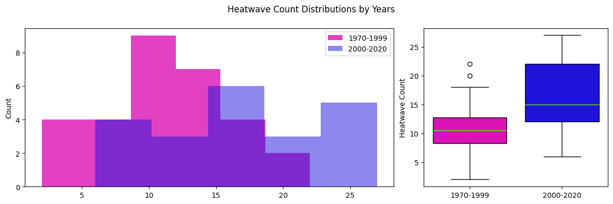
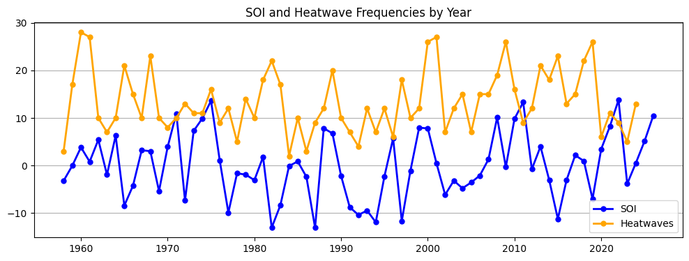
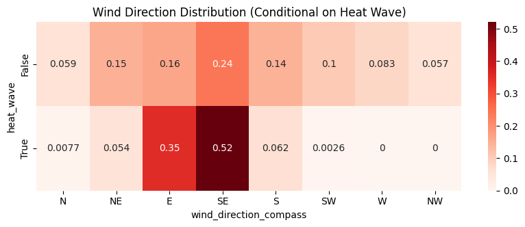
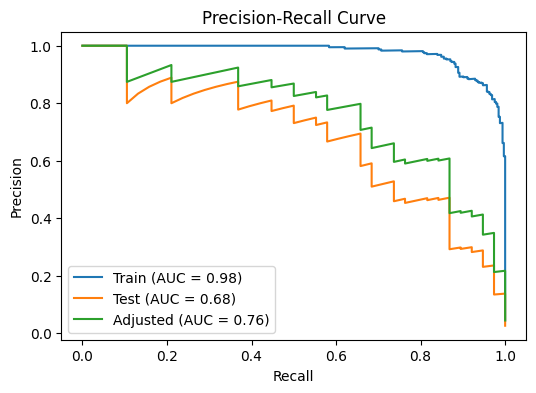
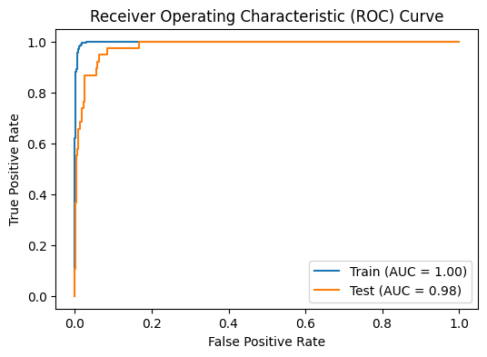
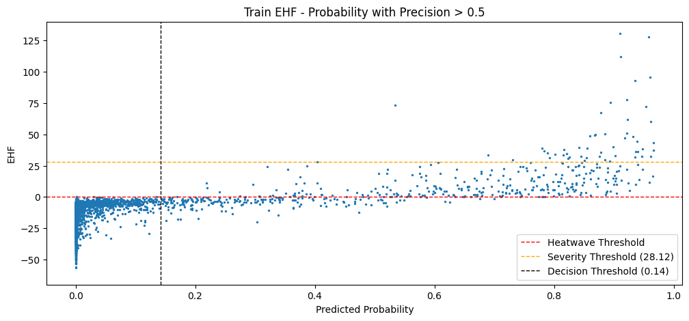
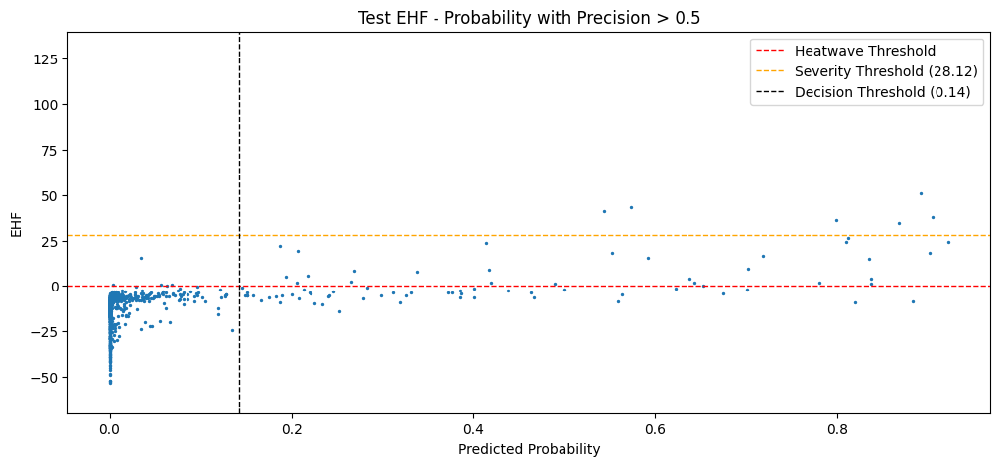
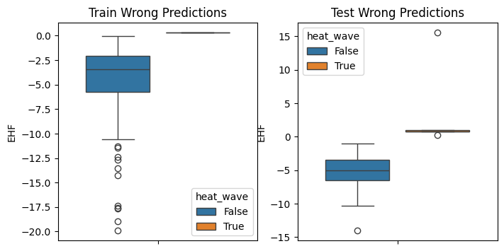

# Adelaide Heatwave Analysis and Prediction

Australia Adelaide 1958-2024 heatwave analyses and 2000-2024 heatwave prediction study.

This project explores heatwave dynamics in Adelaide, Australia by combining data analysis with machine learning techniques. We collect and process historical meteorological data (1958–2024), define heatwave events based on the technical criteria provided by the Australian Bureau of Meteorology and associated research sources, and analyze their temporal and statistical characteristics.

Building on this analysis, we develop a short-term binary classification model to predict heatwave occurrence for the period 2000–2024 using recent weather conditions. The study focuses on applying fundamental statistical and machine learning principles within a time-series framework, aiming to produce interpretable and practically useful results.

## Table of Contents

- [Project Overview](#project-overview)
- [Methodology & Notebook Structure](#methodology--notebook-structure)
- [Heatwave Analysis Key Findings](#heatwave-analysis-key-findings)
- [Multivariate Analysis Key Findings](#multivariate-analysis-key-findings)
- [Model Results and Evaluation](#model-results-and-evaluation)
- [Limitations and Disclaimers](#limitations-and-disclaimers)
- [Future Work](#future-work)
- [Data Source](#data-source)
- [References](#references)
- [Tech Stack](#tech-stack)

## Project Overview

Heatwaves are defined as periods of unusually high maximum and minimum temperatures sustained over multiple days relative to the local climate. In this project, we adopt the methodology of the Australian Bureau of Meteorology (BOM), which quantifies heatwave intensity using the Excess Heat Factor (EHF) and classifies events into severity levels.

Heatwaves are associated with significant impacts on human health, infrastructure, and environmental systems, particularly as their intensity increases. They can pose serious risks to vulnerable populations such as older individuals and those working outdoors, while also affecting agriculture, transportation, and energy systems through increased stress, demand, and potential disruptions.

We analyze heatwave characteristics in Adelaide, Australia using historical meteorological data from 1958 to 2024. This includes temporal analysis at monthly and yearly scales, as well as multivariate exploration of relationships between EHF, severity classes, and other weather variables for the period 2000–2024.

Building on this analysis, we develop a short-term binary classification model to predict whether current and near-future weather conditions (up to two days ahead) will result in a heatwave event.

## Methodology & Notebook Structure

The project follows a structured workflow combining data validation, heatwave index construction, exploratory analysis, feature engineering, and machine learning modeling. Each step is implemented in a separate notebook.

**1. Data Collection & Initial Checks:** Meteorological data is obtained from Open-Meteo and used without additional preprocessing, as it is already quality-controlled by the source. Visual inspections are performed to verify consistency and completeness. Notebook: [`01_data_acquisition.ipynb`](01_data_acquisition.ipynb)

**2. Data Validation:** Potential inconsistencies and sensor-related issues are examined by cross-validating related variables and comparing them with external references. Notebook: [`02_data_validation.ipynb`](02_data_validation.ipynb)

**3. Heatwave Index Construction:** Using established formulations from technical reports (including those by the Australian Bureau of Meteorology and associated research groups), key indices are derived from hourly temperature data (1958–2024):
* EHI_sig (significance index)
* EHI_accl (acclimatization index)
* EHF (Excess Heat Factor)
* Heatwave severity classifications

Notebook: [`03_heatwave_definition_and_identification.ipynb`](03_heatwave_definition_and_identification.ipynb)

**4. Exploratory Data Analysis:** Heatwaves' evolution in time *(1958–2024)*;  multivariate relationships between EHF, severity levels, and other meteorological variables *(2000–2024)* are analyzed using:
* plotting
* temporal analysis in monthly and yearly resolutions
* cross tables and statistical summaries
* hypothesis testing
* time series decomposition

Notebooks: [`04_heatwave_analysis.ipynb`](04_heatwave_analysis.ipynb), [`05_eda_and_statistical_analysis.ipynb`](05_eda_and_statistical_analysis.ipynb)

**5. Feature Engineering:** Predictive features are constructed from base weather variables and derived heatwave indices including:
* lag features
* rolling statistics (mean, std, etc.)

Feature grouping and dimensionality reduction are applied using correlation-based clustering and Principal Component Analysis (PCA).

Notebook: [`06_feature_engineering.ipynb`](06_feature_engineering.ipynb)

**6. Feature Selection:** Used machine learning evaluation metrics are decided:
* PR-AUC (Precision–Recall Area Under Curve) as the main metric
* ROC-AUC (Receiver Operating Characteristic AUC) as supporting metric
* precision and recall as supporting metrics

Feature importance is evaluated separately for:

* linear models (logistic regression)
* non-linear models (gradient boosting)

Selection is done by averaging absolute coefficients (logistic regression) and feature importances (gradient boosting) by weighting them with cross-validation PR-AUC values.

Notebook: [`07_feature_selection.ipynb`](07_feature_selection.ipynb)

**7. Model Development & Selection:** Multiple machine learning models are evaluated using time-series cross-validation. Performance is primarily assessed using the metric set decided in step 6, notebook `07_feature_selection.ipynb`.

Notebook: [`08_classification_model_selection.ipynb`](08_classification_model_selection.ipynb)

**8. Model Evaluation & Refinement:** The selected model is further analyzed through:

* train–test feature distribution comparison using Wasserstein distance
* probability–EHF relationship analysis

And refined using:

* probability calibration via Platt Scaling with cross-validation
* decision threshold optimization based on recall and precision trade-offs.

Notebook: [`09_model_calibration_and_analysis.ipynb`](09_model_calibration_and_analysis.ipynb)

##  Heatwave Analysis Key Findings 
**Increase in Heatwave Day (EHF > 0) Frequency** 
We observe a statistically significant increase in the yearly frequency of heatwave days (EHF > 0) when comparing the periods 1970–1999 and 2000–2020. The difference is supported by hypothesis testing (p-value = 0.0011), indicating a meaningful shift in heatwave occurrence over time.

**Increase in Heatwave Intensity** 
A comparison of maximum yearly EHF values between 1958–1999 and 2000–2020 shows a statistically significant difference (p-value = 0.0310), indicating a shift toward more intense heatwave events in recent decades.

**Relation with Large-Scale Climate Variability** 
We observe that peaks in yearly heatwave frequency exhibit a noticeable alignment with positive phases of the
Niño 3.4 Index.
This suggests a potential influence of large-scale climate variability El-Niño Southern Oscillation (ENSO) on regional heatwave patterns.

**Seasonal Pattern** 
Heatwave occurrences are concentrated in mid-summer months, with the highest frequencies observed during the peak summer period, as expected.

Additional information and plots are available in the notebook [`04_heatwave_analysis.ipynb`](04_heatwave_analysis.ipynb).

## Multivariate Analysis Key Findings

Multivariate analyses are conducted on same-day observations (e.g., EHF and other meteorological variables on a given date) for the period 2000–2024 to explore relationships between heatwave occurrence, severity, and atmospheric conditions.

**Wind Direction Patterns** 
Wind direction shows a strong association with heatwave events. During heatwaves, winds are predominantly from the East and South-East, accounting for approximately 87% of cases. In contrast, non-heatwave days exhibit a more distributed pattern across North-East, East, South-East, and South directions. Notably, West and North-West directions are not observed during heatwave events.

**Feature Distributions and Predictive Signals** 
Across many variables (e.g., mean sea level pressure, relative humidity), heatwave instances—and especially higher severity events—tend to concentrate within relatively narrow value ranges. However, due to the rarity of heatwaves, these patterns are often overlapped by non-heatwave observations.

Despite this overlap, the results indicate that short-term prediction remains feasible when leveraging:
* derived features through feature engineering
* multivariate relationships
* non-linear modeling approaches

These findings support the overall modeling objective of predicting heatwave events based on recent atmospheric conditions.

## Model Results and Evaluation

**Experimental Setup** 
The final model is trained on the period 2000–2020 and evaluated on a forward test set covering 2021–2024, ensuring a realistic temporal separation. Model selection and hyperparameter tuning are performed using cross-validation on the training set only.

**The selected model is:** 
``XGBoost(eta=0.1, gamma=0.1, lambda=0.75, max_depth=4, scale_pos_weight=False, n_estimators=61)``

**The event prevalence differs between periods:** 
* Train (2000–2020): 0.044
* Test (2021–2024): 0.026

**Model Performance (Default Threshold = 0.5)** 
Model performance is evaluated both on the full training set and through cross-validation on the training period.

*Cross-validation test fold summaries (mean ± std):* 
* PR-AUC: 0.7492 ± 0.0702
* Adjusted PR-AUC: 0.7406 ± 0.0924
* ROC-AUC: 0.9811 ± 0.0078

*Final model performance (trained on full training data):* 
| Metric | Train (Full) | Test |
| :-- | :--: | :-- |
| Recall | 0.867 | 0.553 |
| Precision | 0.952 | 0.724 |
| PR-AUC | 0.976 | 0.680 |
| ROC-AUC | 0.999 | 0.982 |
| PR-AUC (Adj) | — | 0.764 |

The test ROC-AUC remains consistent with cross-validation, and the adjusted PR-AUC falls within the expected CV range, indicating stable generalization despite changes in event prevalence between periods.

To further assess generalization, we compare feature distributions between train and test sets using Wasserstein distance. The results do not indicate any notable distribution shift across the selected features, suggesting that the model operates under relatively stable conditions. This supports the idea that the model’s performance is not driven by distribution differences and remains reasonably robust when applied to forward time periods. For more details, see the notebook [`09_model_calibration_and_analysis.ipynb`](09_model_calibration_and_analysis.ipynb), section **Feature Distribution Analysis**.

**Calibration Observations** 
Probability calibration is evaluated using Expected Calibration Error (ECE). Results indicate that:

* Raw probabilities perform better overall compared to calibrated outputs
* Calibration improves certain probability regions while degrading others

Given these findings, subsequent analysis and threshold optimization are conducted using raw model probabilities, while calibrated outputs are retained as complementary references. Detailed calibration analysis and reliability curves are provided in the associated notebook, [`09_model_calibration_and_analysis.ipynb`](09_model_calibration_and_analysis.ipynb).

**Decision Threshold Optimization** 
Given the rare-event nature of heatwaves, the decision threshold is optimized under the constraint:

Maximize recall subject to precision ≥ 0.5

The selected threshold is: 0.14

| Metric | Train | Test |
| :-- | :--: | :-- |
| Recall | 0.997 |	0.868 |
| Precision | 0.622 | 0.413 |

At this threshold, the model captures nearly all heatwave events, missing only a very small number of cases in both train and test sets.

**Probability–EHF Relationship and Interpretability**

Model probabilities show a strong and interpretable relationship with heatwave intensity (EHF):
* Higher predicted probabilities correspond to higher EHF values
* Severe and extreme heatwaves are consistently detected
* The model assigns progressively higher probabilities as event severity increases
* Misclassified cases are concentrated near the decision boundary:
* False negatives correspond to low-intensity heatwaves
* False positives correspond to near-threshold non-heatwave days (EHF ≈ 0)

These patterns indicate that the model is well-aligned with the physical definition of heatwaves and produces meaningful probability outputs.

## Limitations and Disclaimers

This project is an applied data science study rather than a domain-expert climate analysis. While we follow fundamental statistical and machine learning practices, interpretations should be considered within this scope.

**Domain Background**  
This work is not carried out by a climate scientist or meteorology expert. The analysis is based on general data science practices and publicly available technical resources.

**Definition of Prediction Target (EHF Context)** 
The Excess Heat Factor (EHF) is defined over a three-day period, including the current day and the following two days. For this reason, using current-day atmospheric variables does not introduce data leakage. However, it also means that the model effectively performs short-term (multi-day) prediction of heatwave conditions.

**Model Selection Approach** 
Due to the combination of:
* relatively limited data size
* rare-event nature of heatwaves
* time-dependent structure of the data

model and hyperparameter selection are performed using a single cross-validation setup on the training period. More complex approaches (like nested cross-validation) are not used, but we take care to avoid selection bias by keeping the test set completely untouched until the final evaluation.

**Data Source Considerations** 
The daily minimum and maximum temperature variables provided by Open-Meteo could not be directly verified against the exact definitions used in heatwave-related technical reports. To stay consistent, these variables are recomputed from hourly temperature data from the same source.

**No Spatial Analysis** 
The study focuses on a single location and does not include spatial analysis. All work is based on local, tabular data without modeling regional or spatial relationships.

**Code Structure and Optimization** 
Throughout the project, the main focus is on analysis, modeling, and reporting rather than code optimization or strict software engineering practices. While the code is structured and functional, it is not fully optimized or refactored for production-level use.

*Note:* 
Although *“we”* is used throughout for clarity and convention, this project is carried out by a single individual.

## Future Work

There are several directions in which this study can be extended, both from modeling and scientific perspectives:

**Deployment as a Web Application** 
The selected model can be integrated into a simple web application, enabling users to generate heatwave predictions and associated probabilities for a given time interval through an easy-to-use interface.

**Regression-Based Modeling** 
In addition to classification, regression models can be developed using the full feature space to predict continuous targets such as daily mean temperature (DMT) and EHF values, allowing more detailed analysis of heatwave intensity.

**Spatial Extension of the Study** 
The analysis can be expanded beyond a single location by incorporating spatial methods. Extending the study to nearby regions or major cities such as Sydney and Melbourne may provide broader insights and improve generalization.

**Further Investigation of Wind and Distribution Shifts** 
Features showing relatively higher Wasserstein distances—particularly wind-related variables—can be studied in more detail. Their potential relationship with large-scale climate patterns such as ENSO could provide additional scientific insight.

**Advanced Model Validation Strategies** 
With more data or computational resources, more advanced validation approaches (e.g., nested time-series cross-validation or multi-regime evaluation) could be applied to further strengthen model selection and robustness analysis.

**Incorporation of Additional Climate Indices** 
Including other large-scale climate indicators (beyond ENSO) may help explain variability in heatwave patterns and improve predictive performance.

## Data Source

Weather data used in this project is provided by Open-Meteo. 
<a href="https://open-meteo.com/">
	Weather data by Open-Meteo.com
</a> (licensed under CC BY 4.0)

## References

* Zippenfenig, P. (2023). Open-Meteo.com Weather API [Computer software]. Zenodo. https://doi.org/10.5281/zenodo.7970649
* Nairn, J., & Fawcett, R. (2013). Defining heatwaves: Heatwave defined as a heat-impact event servicing all community and business sectors in Australia. CAWCR Technical Report No. 060.
https://www.cawcr.gov.au/technical-reports/CTR_060.pdf
* Bureau of Meteorology (2024). Heatwave Service Level Specification (Season 2023–2024).
https://www.bom.gov.au/sites/default/files/2024-03/foi30-123-released-documents-set-2.pdf
* Bureau of Meteorology. (n.d.). What is a heatwave?
https://www.bom.gov.au/resources/learn-and-explore/heatwave-knowledge-centre/what-is-a-heatwave
* Bureau of Meteorology. (2025). Heatwaves: What you need to know
https://www.bom.gov.au/news-and-media/heatwaves-what-you-need-to-know

## Tech Stack

The project is developed using the following tools and libraries:

* NumPy
* pandas
* Matplotlib
* seaborn
* Plotly
* scikit-learn
* XGBoost
* SciPy
* statsmodels